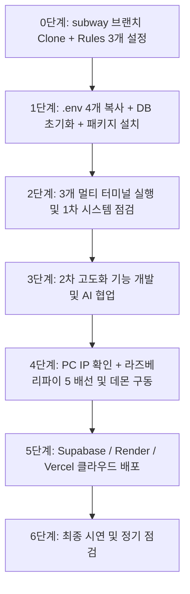

# 학생 수작업 로드맵 (2차 개발 체크리스트)

> 📂 **본편 02 / 팀 전원 / 2차 개발 진행 체크용** · 상세 설명은 [01-학생용-설치-및-사용-매뉴얼](01-학생용-설치-및-사용-매뉴얼.md) · 전체 목록 [docs/README.md](README.md)

> AI에게 프롬프트로 시키지 않고 **학생이 직접 터미널/GUI/브라우저로 실행해야 하는 작업만** 모은 요약 체크리스트입니다.  
> 세부 절차와 확인 방법은 **`docs/01-학생용-설치-및-사용-매뉴얼.md`**를 따르고, 이 문서는 실습 중 진행 체크용으로 활용합니다.



---

## 0단계. 저장소 받기 & Antigravity IDE 설정 (팀원 각자 1회)

- [ ] `subway` 브랜치 클론:
  ```powershell
  git clone -b subway https://github.com/foxjini/agent-vibe-coding-starter-kit2.git iot-subway-system
  cd iot-subway-system
  ```
- [ ] Antigravity IDE에서 `iot-subway-system` 폴더 열기
- [ ] Customizations → Rules에서 **3개만 Always On** 설정:
  - `karpathy-principles`
  - `security-rules`
  - `coding-standards`
- [ ] 1차 완성 파일 구조 확인 (`backend/`, `frontend/`, `vision/`, `pi/`, `AGENTS.md`)

---

## 1단계. 환경변수(.env) 설정 & 패키지/DB 준비 (학생 직접 실행)

- [ ] `.env.example` → `.env` 4개 파일 복사:
  ```powershell
  copy backend\.env.example backend\.env
  copy frontend\.env.example frontend\.env
  copy vision\.env.example vision\.env
  copy pi\.env.example pi\.env
  ```
- [ ] `backend/.env`, `vision/.env`, `pi/.env`의 `DEVICE_API_KEY`를 팀 고유 비밀키로 동일하게 맞추기
- [ ] XAMPP Control Panel에서 **MySQL(MariaDB)** Start
- [ ] MariaDB 초기화 실행:
  ```powershell
  Get-Content backend\db\init.sql | mysql -u root
  ```
  *(mysql 명령어 미지원 시 phpMyAdmin SQL 탭에 붙여넣어 실행)*
- [ ] 백엔드 가상환경 설정 및 패키지 설치:
  ```powershell
  cd backend
  python -m venv venv
  .\venv\Scripts\Activate.ps1
  pip install -r requirements.txt
  cd ..
  ```
- [ ] 프론트엔드 패키지 설치:
  ```powershell
  cd frontend
  npm install
  cd ..
  ```
- [ ] 비전 가상환경 설정 및 패키지 설치:
  ```powershell
  cd vision
  py -3.12 -m venv venv
  .\venv\Scripts\Activate.ps1
  pip install -r requirements.txt
  cd ..
  ```

---

## 2단계. 1차 완성 지하철 시스템 로컬 구동 점검 (터미널 3개 동시 유지)

- [ ] **[터미널 1] 백엔드 서버 실행**:
  ```powershell
  cd backend
  .\venv\Scripts\Activate.ps1
  uvicorn main:app --reload --port 8000
  ```
  - `http://localhost:8000/docs` 및 `/health` 정상 접속 확인
- [ ] **[터미널 2] 프론트엔드 대시보드 실행**:
  ```powershell
  cd frontend
  npm run dev
  ```
  - `http://localhost:3000` 접속 후 상단 **"● 실시간 연결됨"** 녹색 배지 점등 확인
  - 지하철 객차 시각화 화면 및 임산부석 카드 확인
- [ ] **[터미널 3] 비전 인식 클라이언트 실행** (사전에 Zoom, Teams 등 웹캠 점유 앱 종료):
  ```powershell
  cd vision
  .\venv\Scripts\Activate.ps1
  python main.py
  ```
  - 웹캠 화면에서 사람 인식 및 터미널에 백엔드 이벤트 전송 로그 확인
- [ ] **통합 동작 확인**:
  - 웹캠 앞에서 인원 변화 시 대시보드의 **혼잡도(여유/보통/혼잡)**가 실시간으로 자동 갱신되는지 확인
  - 대시보드에서 임산부석 압력센서 테스트로 착석 상태 반영 확인
- [ ] Git GUI(Ctrl+Shift+G)로 1단계/2단계 준비 상태 커밋

---

## 3단계. 2차 고도화 기능 개발 (AI 협업)

- [ ] `docs/03-2차완성-AI-개발-핸드북.md`를 참고하여 고도화할 과제 선정:
  - [ ] 혼잡도 분석 알고리즘 고도화 및 구간/시간별 차트 컴포넌트 추가
  - [ ] 임산부석 착석 누적 시간 측정 및 장기 점유 알림 로직
  - [ ] 지하철 배경 모터(컨베이어) 연동 제어 보강
  - [ ] UI/UX 대시보드 편의 기능 개선
- [ ] 새로운 프롬프트 입력 시 관련 에이전트 지정 (예: `frontend-agent`, `backend-agent`)
- [ ] 기능 추가 후 로컬 브라우저 및 터미널에서 동작 확인
- [ ] 변경 사항 Git 커밋

---

## 4단계. 라즈베리파이 5 하드웨어 마이그레이션

- [ ] `docs/부록A-백엔드-라즈베리파이5-연동-인터페이스-가이드.md` 확인
- [ ] Windows PC IP 확인 (`ipconfig` IPv4 주소)
- [ ] `pi/.env`의 `BACKEND_URL`에 PC IP 입력 (`http://[PC_IP]:8000`)
- [ ] `backend/.env`에서 `DEVICE_MODE=hardware`로 전환 후 백엔드 재시작
- [ ] **전원을 끈 상태**에서 교사 입회 하에 배선 작업 진행
- [ ] 라즈베리파이 5 터미널에서 데몬 실행:
  ```bash
  cd pi
  python3 -m venv venv
  source venv/bin/activate
  pip install gpiozero lgpio requests python-dotenv
  python main.py
  ```
- [ ] 대시보드 및 웹캠 연동에 따라 실제 라즈베리파이(LED, 모터, 센서)가 동작하는지 확인
- [ ] 변경 사항 Git 커밋

---

## 5단계. 클라우드 배포

- [ ] Supabase 프로젝트 생성 및 MariaDB 스키마 마이그레이션 실행
- [ ] Render에서 FastAPI 백엔드 Web Service 생성 및 환경변수 등록
- [ ] Vercel에서 Next.js 프론트엔드 프로젝트 생성 및 `NEXT_PUBLIC_API_BASE_URL` 등록
- [ ] 배포 URL로 외부 네트워크에서 전체 시스템 통합 시연 (비전 → 백엔드 → 실기기/대시보드)

---

## 6단계. 최종 점검 및 일상 유지보수

- [ ] 신규 기능 추가 시마다 `.agents/workflows/health-check.md`로 무결성 점검
- [ ] 에러 발생 시 에러 로그만 복사해 `.agents/workflows/bugfix.md`로 최소 범위 수정 요청
