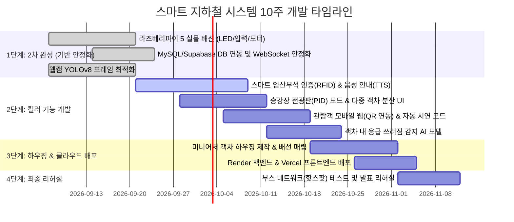

# 04. 작품전시회 대비 추가기능 기획 및 10주 개발 로드맵

> **작성일**: 2026-09-06  
> **전시 목표일**: 2026년 11월 중순 (약 10주간 개발)  
> **적용 브랜치**: `subway`  
> **프로젝트**: AI 기반 지하철 객차 혼잡도 실시간 분석 및 임산부석 안내 스마트 시스템

---

## 1. 문서 목적 및 배경

본 문서는 현재 구축된 지하철 스마트 제어 시스템(YOLOv8 기반 인원 계측, 3색 혼잡도 LED, 단순 임산부석 압력센서, 컨베이어 배경 모터)을 바탕으로, **2026년 11월 중순 작품 전시회(캡스톤/엑스포)에서 관람객과 심사위원의 시선을 사로잡고 기술적 완성도를 인정받기 위한 추가 기능 아이디어와 10주 단계별 로드맵**을 정의합니다.

기존 2차 완성(라즈베리파이 5 실물 배선 및 DB 연동)을 안정적으로 마무리함과 동시에, 남은 기간(약 10주) 동안 무리 없이 구현할 수 있는 실현 가능한 킬러 피처를 선별하여 팀원 4인이 효율적으로 협업할 수 있는 가이드를 제공합니다.

---

## 2. 현재 시스템 진단 (전시회 관점의 한계와 개선점)

| 점검 항목 | 현재 상태 | 전시회 시연 시 예상되는 한계 및 질문 | 보완 방향 |
|---|---|---|---|
| **임산부석 감지** | 압력센서에 물체가 올라가면 단순 점유(`occupied`) 표시 | **"누가 앉아도 점유로 뜨는데, 비임산부와 임산부를 어떻게 구분하나요?"** (심사위원 단골 질문) | RFID 카드/QR/스마트태그 인증 및 비인증 착석 시 자동 음성/경고 안내 |
| **혼잡도 표출 대상** | 관제실용 웹 대시보드(모니터링)만 존재 | 혼잡도는 열차 안에서 보는 것보다 **"승강장에 서 있는 승객이 덜 붐비는 칸으로 타도록 돕는 것"**이 핵심 | 승강장 디지털 안내 전광판(PID) 뷰 및 다중 객차(1~4호차) 분산 추천 UI 분리 |
| **관람객 인터랙션** | 모니터 화면과 LED 깜빡임을 멀리서 지켜봄 | 관람객이 직접 만져보거나 체험할 요소가 부족하여 체류 시간이 짧음 | 관람객 스마트폰으로 부스 QR을 찍어 실시간 좌석 확인 및 가상 호출 체험 |
| **시연 운용성** | 인원 수동 변경, 버튼 수동 클릭으로 각 요소 개별 테스트 | 쉴 새 없이 몰려드는 관람객 앞에서 매번 수동 조작 시 버그/타이밍 오류 발생 위험 | **원클릭 자동 주행·정차 시연 모드 (60초 쇼케이스 시퀀스)** 탑재 |
| **AI 기술적 깊이** | 기본 YOLOv8 인원 카운팅 (person count) | 단순 인원 계측 라이브러리 활용 수준으로 평가절하될 우려 | 객차 내 쓰러짐(응급환자) 등 **지하철 특화 이상행동 감지 AI** 확장 |

---

## 3. 전시회 특화 5대 킬러 기능 아이디어

```
                    ┌──────────────────────────────────────────────┐
                    │      [스마트 지하철 통합 관제 & 승객 시스템]       │
                    └──────────────────────┬───────────────────────┘
                                           │
         ┌───────────────────┬─────────────┴───────────┬───────────────────┐
         ▼                   ▼                         ▼                   ▼
 💖 스마트 임산부석      🚉 승강장 전광판(PID)       📱 관람객 모바일 웹       🚊 원클릭 자동 시연
 [핑크라이트 & 음성안내]   [1~4호차 분산 탑승 추천]    [스마트폰 실시간 연동]     [주행-정차-승하차 데모]
 (RFID 태그 + TTS 스피커)  (역 승강장 대형 디스플레이)   (부스 QR코드 접속)        (컨베이어 모터 연동)
```

### [Killer 1] 💖 스마트 임산부석 '핑크라이트' 실물 인증 & 음성 안내 (Hardware + Vision/IoT) — **[강력 추천]**
- **기획 의도**: 실제 부산/서울교통공사 '핑크라이트' 시스템을 벤치마킹하여, 비임산부 착석 방지 및 교통약자 배려 문화를 스마트하게 해결.
- **구현 방식**:
  1. **비인증자 착석 (일반인/짐)**: 좌석 압력센서에 압력이 가해졌으나 5초 이내에 임산부 인증이 없으면:
     - 라즈베리파이 스피커/TTS를 통해 경고 및 안내 방송 출력 (*"이 좌석은 임산부 배려석입니다. 도움이 필요한 분께 양보해 주시기 바랍니다."*)
     - 주황/빨강 LED가 부드럽게 점멸.
  2. **임산부 착석 (인증 성공)**: 좌석 부근 RFID 리더기(RC522)에 '임산부 등록 카드'를 태깅하거나, 웹캠에 핑크 뱃지/QR 인식 시:
     - **핑크색(또는 보라색) 무드 LED 점등**
     - 환영 멘트 방송 (*"임산부 고객님 환영합니다. 편안하고 안전한 여행 되세요."*)
- **전시 시연 연출**:
  - 부스에 일반 곰인형과 '임산부 배려 카드'를 목에 건 곰인형 2개를 비치.
  - 관람객이 일반 인형을 앉히면 양보 음성이 나오고, 임산부 인형을 앉히면 핑크빛 불이 들어오는 인터랙션 시연 (관람객 몰입도 최고).

---

### [Killer 2] 🚉 승강장 승객용 디지털 안내 전광판 (PID) & 분산 탑승 추천 (Frontend + Backend) — **[필수 추천]**
- **기획 의도**: 관리자 중심의 관제 대시보드와 분리된, **승강장 대기 승객 관점의 대형 디스플레이** 구현.
- **구현 방식**:
  1. **승강장 안내 뷰(`app/station/page.tsx`)**:
     - 실제 지하철 플랫폼 전광판 느낌의 다크 모드 풀스크린 UI.
     - 4량 열차(1호차~4호차)의 실시간 혼잡도 시각화:
       - `1호차: 여유 (초록, 25%)` | `2호차: 혼잡 (빨강, 92%)` | `3호차: 보통 (주황, 60%)` | `4호차: 여유 (초록, 30%)`
  2. **스마트 탑승 추천 알고리즘**:
     - *"📢 현재 2호차가 매우 혼잡합니다. 1호차(승강장 1-1) 또는 4호차(승강장 4-3)로 이동하시면 쾌적하게 탑승하실 수 있습니다."*
     - 대기 승객이 자연스럽게 덜 붐비는 위치로 이동하도록 시각적 화살표 표시.

---

### [Killer 3] 📱 관람객 스마트폰 참여형 모바일 웹 (QR 즉시 접속) (Frontend + Deployment)
- **기획 의도**: 전시 부스를 지나가는 관람객이 자기 스마트폰으로 직접 조작해보는 체험형 IoT 전시 구축.
- **구현 방식**:
  - 전시 부스 테이블에 **"스마트폰 카메라로 비춰보세요"** 안내판과 QR 코드 인쇄.
  - 스마트폰 브라우저에 최적화된 모바일 페이지(`app/mobile/page.tsx`, Vercel 배포 URL):
    - 실시간 열차 혼잡도 및 임산부석 점유 여부 확인.
    - **[임산부 승차 알림 버튼]**: 관람객이 스마트폰에서 "임산부 탑승 예정" 버튼을 누르면, 전시 부스의 미니어처 열차 핑크 LED가 깜빡이며 자리 비움을 사전 요청.
  - 심사위원이 자기 폰으로 버튼을 눌렀을 때 라즈베리파이의 하드웨어가 실시간(WebSocket)으로 반응하는 순간 강력한 인상을 남김.

---

### [Killer 4] 🚊 컨베이어 연동 '원클릭 60초 자동 운행·정차 시연 모드' (Hardware + Backend)
- **기획 의도**: 전시장에서 반복적으로 설명할 때 버튼 하나로 주행부터 정차, 승하차, 센서 반응까지 1분 사이클로 매끄럽게 자동 시연.
- **구현 방식**:
  - 대시보드 상단에 **[🎬 원클릭 시연 시작]** 버튼 배치.
  - **시연 자동화 시퀀스 (총 60초)**:
    1. **0~15초 (주행)**: 출발 알림음 + 컨베이어 모터 구동 (배경 이동) + 주행 중 안내.
    2. **15~25초 (진입 및 정차)**: 도착역 안내 방송 + 컨베이어 감속 정지 + 출입문 열림 효과음.
    3. **25~45초 (승하차 및 혼잡도 변동)**: 승객 인원 변동(웹캠 앞 사람 이동 또는 가상 주입) → 혼잡도 재계산 → 승강장 LED 및 전광판 색상 변경(여유→혼잡).
    4. **45~60초 (임산부석 인터랙션)**: 좌석 착석 감지 및 음성 안내 → 다음 역 출발 대기.

---

### [Killer 5] 🚨 (AI 심화) 객차 내 승객 쓰러짐/응급상황 실시간 감지 (Vision + Backend)
- **기획 의도**: 단순 인원 카운팅 라이브러리 활용을 넘어, **도시철도 안전 관제 AI**로서의 기술적 차별성 확보.
- **구현 방식**:
  - YOLOv8 Bounding Box 종횡비(Bounding Box 가로 너비 > 세로 높이) 또는 머리/어깨의 급격한 Y축 낙하 좌표 추적.
  - 바닥에 쓰러진 사람 감지 시 `emergency_fall` 이벤트를 백엔드로 전송.
  - 관제 대시보드 화면에 붉은색 비상 사이렌 팝업 표시 (*"🚨 1호차 응급 환자(실신/쓰러짐) 발생! 역무실 긴급 출동 요청"*).

---

## 4. 11월 중순 전시 대비 10주 단계별 마일스톤

총 10주의 기간 동안 기존 기능 안정화(3주) → 킬러 기능 개발(4주) → 하우징 및 배포(2주) → 최종 리허설(1주) 순으로 진행합니다.



### 상세 주차별 계획

| 단계 | 주차 | 기간 | 주요 목표 및 세부 작업 |
|---|---|---|---|
| **1단계: 2차 완성 (기반 안정화)** | **1~2주차** | 09.07 ~ 09.20 | • **라즈베리파이 5 실물 연동**: 3색 LED, 압력센서(FSR), 모터 드라이버 GPIO 핀 배선 및 `pi/main.py` 안정화<br>• **DB 연동**: 센서 측정값 및 비전 감지 이력 MySQL/Supabase 영구 저장<br>• **비전 최적화**: 웹캠 DirectShow + ONNX 모델 프레임 속도(FPS) 15 이상 확보 |
| **2단계: 킬러 기능 개발** | **3~5주차** | 09.21 ~ 10.11 | • **스마트 임산부석**: RC522 RFID 리더기 배선 및 카드 태깅 인식, 파이 스피커/TTS 음성 안내 연동<br>• **승강장 PID 모드**: Next.js 풀스크린 승강장 전광판 페이지 및 1~4호차 분산 탑승 추천 알고리즘 구현<br>• **AI 이상행동 감지**: 비전 클라이언트에서 쓰러짐/응급상황 감지 로직 추가 |
| **2단계: 킬러 기능 개발** | **6~7주차** | 10.12 ~ 10.25 | • **모바일 웹 연동**: 스마트폰 최적화 UI(`app/mobile`) 및 현장 배포용 QR 코드 생성<br>• **원클릭 자동 시연 모드**: 60초 자동 주행-정차-승하차 시퀀스 매크로 백엔드/프론트엔드 연동 |
| **3단계: 하우징 및 배포** | **8~9주차** | 10.26 ~ 11.08 | • **미니어처 하우징 제작**: 아크릴/폼보드로 1호차 객차 모형 제작, 내부에 센서/LED/카메라 깔끔 매립<br>• **클라우드 배포**: Render(FastAPI) 및 Vercel(Next.js) 배포 완료 |
| **4단계: 최종 리허설** | **10주차** | 11.09 ~ 전시일 | • **전시장 네트워크 대비**: 무선 와이파이 단절 시 스마트폰 테더링(핫스팟) 로컬 모드 리허설<br>• **발표 시나리오 점검**: 1분/3분 관람객 맞춤형 시연 대본 및 포스터 최종 완성 |

---

## 5. 팀원 4인 역할 분담 (R&R) 최적화

| 팀원 / 파트 | 핵심 담당 업무 (11월 전시회 기준) |
|---|---|
| **[팀원A] Frontend (Next.js)** | 1. 승강장 대기 승객용 풀스크린 디지털 전광판(PID) 모드 구현<br>2. 관람객 스마트폰 접속용 모바일 웹 UI(`app/mobile`) 구축<br>3. 관제 대시보드에 [원클릭 60초 자동 시연 모드] 제어 패널 추가 |
| **[팀원B] Backend & DB (FastAPI / Supabase)** | 1. 스마트 임산부석 인증(RFID/태그) 판별 및 미인증 착석 타이머/트리거 API 구현<br>2. 1~4호차 다중 객차 혼잡도 시뮬레이션 및 분산 탑승 추천 로직 개발<br>3. Render 클라우드 배포 및 전시 현장용 오프라인 로컬 번들링 구성 |
| **[팀원C] Hardware (라즈베리파이 5 & 미니어처)** | 1. 라즈베리파이 5 실물 배선 (LED 3색, 핑크 무드등, 압력센서, RC522 RFID 리더기)<br>2. 미니 스피커 연결 및 안내 음성/효과음 재생(TTS/mp3) 스크립트 작성<br>3. 미니어처 객차/승강장 하우징 제작 및 배선 내부 매립 (전시 미관 총괄) |
| **[팀원D] Vision (YOLOv8 & 웹캠)** | 1. 웹캠 실시간 승객 수 계측 안정화 및 혼잡도 판별 신뢰도 향상<br>2. 객차 내 승객 쓰러짐(응급상황) 감지 알고리즘 추가<br>3. 미니어처 객차 천장에 웹캠 거치 후 화각 및 조명 보정(캘리브레이션) |

---

## 6. 성공적인 전시 부스를 위한 실전 세팅 꿀팁

1. **듀얼 디스플레이 세팅 (시각적 압도감)**:
   - **모니터 1 (메인)**: `관제 센터 대시보드` (웹캠 실시간 영상, 객차 투시도, 센서 로그).
   - **모니터 2 (보조/태블릿)**: `승강장 안내 전광판 (PID)` (승객들이 역에서 보는 친숙한 안내판).
2. **미니어처 하우징의 완성도**:
   - 브레드보드 전선이 적나라하게 드러나면 '미완성 과제'처럼 보입니다. 폼보드나 아크릴 상자로 작은 지하철 1칸 모형을 만들고, 천장에 LED와 웹캠을 달고 좌석 아래에 압력센서를 숨기면 완성도가 3배 이상 높아집니다.
3. **네트워크 안전망 (오프라인 모드)**:
   - 전시장 와이파이는 행사 당일 혼잡으로 인해 100% 불안정해집니다.  
   - 노트북 핫스팟(Wi-Fi 공유)으로 로컬 공유기를 구성하여, **외부 인터넷이 전혀 연결되지 않아도 노트북-라즈베리파이-스마트폰이 로컬 IP(`192.168.x.x`)로 완벽히 작동하는 Standalone 모드**를 반드시 사전 검증해야 합니다.

---

## 7. 관련 문서 및 참고자료

- [01. 학생용 2차 개발 설치 및 사용 매뉴얼](01-학생용-설치-및-사용-매뉴얼.md)
- [02. 학생 수작업 로드맵](02-학생-수작업-로드맵.md)
- [03. 2차 완성 AI 개발 핸드북](03-2차완성-AI-개발-핸드북.md)
- [부록A. 백엔드↔라즈베리파이5 연동 인터페이스 가이드](부록A-백엔드-라즈베리파이5-연동-인터페이스-가이드.md)
- [부록F. 학생용 시스템 해부도](부록F-학생용-시스템-해부도-슬라이드.pptx)
